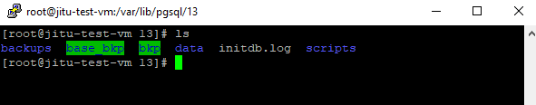

# **POINT IN TIME RECOVERY - LINUX**

---

## Flow

1. Table-1 Creation
    - `time` need to be noted
2. Taking **Base Backup** `1`
    - `data` folder copy to remote location ==> `(data1)`
3. Table-2 Creation 
    - `time` need to be noted
4. Taking **Base Backup** `2`
    - `data` folder copy to remote location ==> `(data2)`
5. Table-3 Creation 
    - PITR `time` need to be noted after operations where data exists
6. Table-2 and Table-3 drop
    - `time` need to be noted
7. Restore at point (5) from `(data1)` of **Base Backup**

> In some OS `main` instead of `data`. In Ubuntu it has `main`

---

## Initial Set Up 

### Step 1: Shell Scripts to Backup and Restore automation

```shell
imrul@pc:/$ cp -R /home/imrul/scripts /var/lib/pgsql/13/scripts # Once in every fresh installation of PG
```



> The above `scripts` folder contains the belows 3 files. 

- base.sh

```bash
#!/bin/bash
cd /var/lib/pgsql/13/
cp -R data base_bkp/data$(date +_%y%m%d_%H%M)

```

- view.sh

```bash
#!/bin/bash
cd /var/lib/pgsql/13/base_bkp
ls

```

- restore.sh

```bash
#!/bin/bash
cd /var/lib/pgsql/13/
read bkpname
DIR="base_bkp/"$bkpname
if [ -d "$DIR" ]; then
    # Take action if $DIR exists. #
    echo "${DIR} is exists"
    mv data bkp/data_bkp$(date +_%y%m%d_%H%M)
    cp -R base_bkp/$bkpname data
else
  ###  Control will jump here if $DIR does NOT exists ###
  echo "${DIR} is not exists"
#   exit 1
fi
```

---

### Step 2: Master to Slave Archiving folder set up

- See the docx [Mounting](https://github.com/imrulhasan273/DBA-Postgres/blob/master/Mounting.md)

---

## **Archiving**

### Step 1: Open `postgresql.conf` using vi

```shell
imrul@pc:/$ vi postgresql.conf  # Open the file using text editor to edit
```


### Step 2: Need to configure the archiving `postgresql.conf`

- **Local archiving**

```text
archive_mode = o
archive_command = 'test ! -f  /var/lib/pgsql/13/pgDataPITR/%f && cp %p  /var/lib/pgsql/13/pgDataPITR/%f'
```

- **Slave archiving**

```text
archive_mode = on
archive_command = 'test ! -f  /var/mnt/archive_wal_dir/%f && cp %p  /var/mnt/archive_wal_dir/%f'
```

> Pointed to **Slaves** `/mnt/archive_wal_dir` directory

### Step 3: Restart the DB cluster

```shell
imrul@pc:/$ sudo systemctl status postgresql-13    # from root user
imrul@pc:/$ sudo systemctl restart postgresql-13   # from root user
```

- [If Failed](https://dba.stackexchange.com/questions/196931/how-to-restart-postgresql-server-under-centos-7)

> Sometimes there may have some issues restarting the DB

- **Error:** `psql: error: could not connect to server: No such file or directory Is the server running locally and accepting connections on Unix domain socket "/var/run/postgresql/.s.PGSQL.5432"?`

- Solution: [I experienced this issue when working....](https://stackoverflow.com/questions/31645550/postgresql-why-psql-cant-connect-to-server)

```shell
imrul@pc:/$ sudo systemctl status postgresql-13
imrul@pc:/$ sudo systemctl restart postgresql-13
imrul@pc:/$ pg_lsclusters
imrul@pc:/$ sudo pg_ctlcluster 13 main start
imrul@pc:/$ sudo nano /var/log/postgresql/postgresql-13-main.log
imrul@pc:/$ sudo chmod -R 0700 /var/lib/pgsql/13/data
imrul@pc:/$ sudo systemctl start postgresql-13
```

## **Major Task**

### Step 1: Create table 1 :: data1

```sql
postgres=# create schema pitr;
postgres=# create table pitr.testPITR1 as select * from pg_class, pg_description;  ---DDL activity
postgres=# select * from current_timestamp; --2021-07-27 03:32:31.618857-04
```

### Step 2: Take Base Backup

- Copy the `data` folder to `base_bkp` folder as `data1`

- To take base backup

```shell
~$ bash /var/lib/pgsql/13/scripts/base.sh
```


### Step 3: Create table 2 :: data2

```sql
postgres=# create table pitr.testPITR2 as select * from pg_class, pg_description;  ---DDL activity
postgres=# select * from current_timestamp; 
```

### Step 4: Take Base Backup

- Copy the `data` folder to `bkp` folder as `data2`

- To take base backup

```shell
~$ bash /var/lib/pgsql/13/scripts/base.sh
```

### Step 5: Create table 3 

```sql
postgres=# create table pitr.testPITR3 as select * from pg_class, pg_description;  ---DDL activity
postgres=# select * from current_timestamp; 
```

### Step 6: DROP `Table-2` and `Table-3` 

```sql
postgres=# drop table pitr.testpitr2;
postgres=# drop table pitr.testpitr3;
postgres=# select * from current_timestamp;
```


## **Restoring**

### Step 1: Stop the server

```shell
imrul@pc:/$ sudo systemctl stop postgresql-13
```

### Step 2: Get back the `basebackup` folder

- move `/var/lib/pgsql/13/data` to `/var/lib/pgsql/13/bkp/"` as `data_bkp1`

- Need to take back copy of `data1` from the remote location `(/var/lib/pgsql/13/base_bkp/)`

- rename `data1` to `data`

- To view base backups

```shell
~$ bash /var/lib/pgsql/13/scripts/view.sh
```

- restore the `basebackup` you want

```shell
~$ bash /var/lib/pgsql/13/scripts/restore.sh    # Input your baseback name to restore 
```

- Permission to the data folder

```shell
~$ sudo chown -R postgres /var/lib/pgsql/13/data 
```

### Step 3: Configure in `postgresql.conf` [v13] or Create `recovery.conf` [v10]

- **Option 1:** Local Restoring

```conf
restore_command = 'cp  /var/lib/pgsql/10/pgDataPITR/%f %p'
recovery_target_time = '2021-07-27 14:00:00'
```

- **Option 2:** Slave Restoring

```conf
restore_command = 'cp  /var/mnt/archive_wal_dir/%f %p'
recovery_target_time = '2021-07-27 14:00:00'
```


### Step 4: Create `recovery.signal` file `[Only for v-13`]

- this `recovery.signal` is just an empty file which indicates that data should start recovering when db starts.

- After completing the restoring process the `recovery.signal` will be vanished!

### Step 5: Restart the server

```shell
imrul@pc:/$ sudo systemctl start postgresql-13
```

### Step 6: Need to resume the DB from Recovering mode

```sql
postgres=# SELECT pg_wal_replay_resume(); --Move to normal mode
```

### Step 6: DB is Ready!!

- `v13`

> After completing the restoring process the recovery.signal will be vanished!

- `v10`

> After completing the restoring process the recovery.conf will be recovery.done

---

---

# **Example**

---

```cmd
pitr 1: 2021-07-26 22:05:27.898092+06
bkp1
pitr 2: 2021-07-26 22:11:39.419188+06
bkp2
pitr 3: 2021-07-26 22:19:20.303399+06
drop 2 & 3: 
```

---


