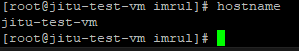
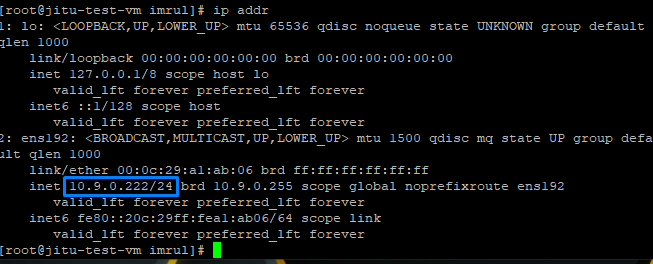
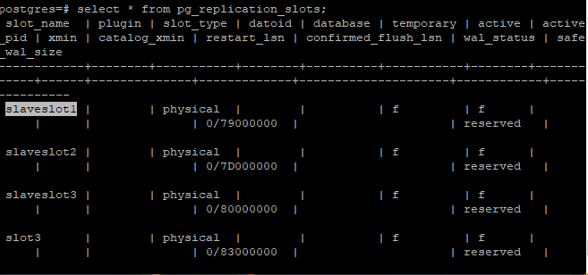
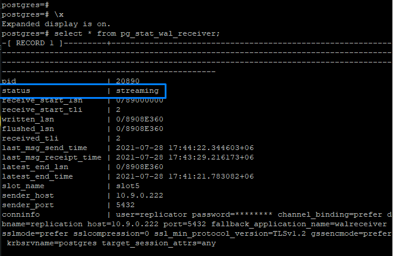
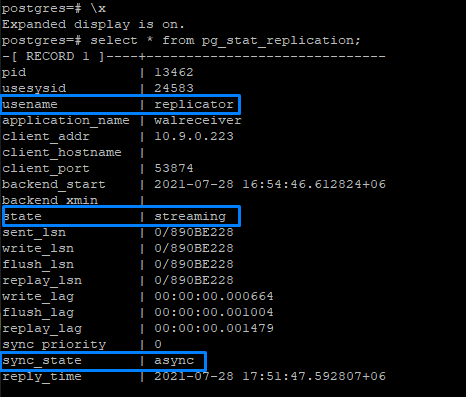

# **PITR Final on (CentOS) Master-Slave(Time Lag)**

---

# **Index**

---

1. Introduction [Query](#Query-1)
2. Chapter-01: Postgres-13 Installation [Query](#Query-2)
3. Chapter-02: Archive Folder Mounting [Query](#Query-3)
4. Chapter-03: Archiving in Master [Query](#Query-4)
5. Chapter-04: Streaming Replication [Query](#Query-5)
6. Chapter-05: Delay Replication [Query](#Query-6)
7. Chapter-06: Incident made in Master DB [Query](#Query-7)
8. Chapter-07: PITR on Slave Server [Query](#Query-8)
9. Chapter-08: Cautions [Query](#Query-9)

---

---

[Index](#Index)

## **Query-1**

# **Introduction**

---

## **Overall Planning**


### Details

1. Master Server on left and Slave Server on right
2. Slave Server is lagged (by any duration configured in slave) from Master Server
3. Wal files of Master Server is archiving in archive_wal_dir dynamically
4. archive_wal_dir in Master Server is mounted on archive_wal_dir in Slave Server
5. PITR will be perform on Slave Server and archive_wal_dir  in slave server


## **Scenario**


### Details

1. Master Server has table PITR1, PITR2, PITR3 with 18 lac data each at day 1
2. Slave Server Synced  PITR1 (18 lac), PITR2 (18 lac) , PITR3 (18 lac) after 3 days later. (day 4)
3. After 3 days (day 4) new Data Added in PITR3 (18 lac) 
4. DROP PITR2 from Master at day 4
5. Now Master server have data of PITR1 (18 lac) and PITR3 (36 lac)
6. Slave Server will sync with Master at Day 7 (3 days later).
7. Slaves have data PITR1 (18 lac), PITR2 (18 lac) , PITR3 (18 lac) between day 4 - day 6
8. So if we want to recover the lost data we need to perform PITR between day 4 and day 6 otherwise master data will be sync with slave on day 7
9. If we want to perform PITR upto point(4). 
	- Note the time. 
	- Stop the slave server, 
	- Turn off standby mode, 
	- Turn on recovery mode 
11. Performing PITR upto point (4) 
12. Data Restored

---

---

[Index](#Index)

## **Query-2**

# **Chapter-01: Postgres-13 Installation**

---

## Installation

---

- [Installation Guide](https://www.postgresql.org/download/linux/redhat/)

### Step 1: Install the repository RPM:

```shell
sudo yum install -y https://download.postgresql.org/pub/repos/yum/reporpms/EL-7-x86_64/pgdg-redhat-repo-latest.noarch.rpm
```

---

### Step 2: Install PostgreSQL

```shell
sudo yum install -y postgresql13-server
```

---

### Step 3: Optionally initialize the database and enable automatic start:

```shell
sudo /usr/pgsql-13/bin/postgresql-13-setup initdb
sudo systemctl enable postgresql-13
sudo systemctl start postgresql-13
```

---

### Step 4: Post Installation

```shell
postgresql-setup --initdb
systemctl enable postgresql.service
systemctl start postgresql.service
```

---

---

[Index](#Index)

## **Query-3**

# **Chapter-02: Archive Folder Mounting**

---

### Step 1: Installation (`Slave`)

```shell
~: $ yum -y install epel-release
~: $ yum install -y fuse-sshfs
```

### Step 2: cd to `/var/mnt` directory (`Master`)

```shell
imrul@master :~$ cd /var/mnt
```

### Step 3: Create a directory in this location (`Master`)

```shell
imrul@master :~$ sudo mkdir archive_wal_dir        
# This folder contains data that to be shared with another server
imrul@master :~$ sudo chmod a+rwx archive_wal_dir
# This folder needs permission 
```

### Step 4: cd to `/mnt` directory (Slave)

```shell
imrul@slave :~$ cd /mnt
```

### Step 5: Create a directory in this location (`Slave`)

```shell
imrul@slave :~$ sudo mkdir archive_wal_dir          
# This is mountpoint. All the data of Master are shared on this Slave
```

### Step 6: SSHFS from slave (`Slave`)

```shell
imrul@slave:~$ sshfs user@[ip]:/var/mnt/archive_wal_dir /mnt/archive_wal_dir
```

- ip	⇒  master ip address
- user	⇒ user_name of server
- `/var/mnt/archive_wal_dir` 	⇒ Source Location of Archive Folder
- `/mnt/archive_wal_dir`		⇒ Destination Location of Archive Folder

---

[Index](#Index)

## **Query-4**

# **Chapter-03: Archiving in Master**

---

### Step 1: Open `postgresql.conf` using vi (`Master`)

```shell
imrul@pc:/$ vi /var/lib/pgsql/13/data/postgresql.conf  # Open the file using text editor to edit
```

### Step 2: Configure archiving in `postgresql.conf` (`Master`)

```conf
archive_mode = on
archive_command = 'test ! -f  /var/mnt/archive_wal_dir/%f && cp %p  /var/mnt/archive_wal_dir/%f'
```

> Pointed to /mnt/archive_wal_dir directory of Slave Server


### Step 3: Restart the DB cluster (`Master`)

```shell
imrul@pc:/$ sudo systemctl status postgresql-13    # from root user
imrul@pc:/$ sudo systemctl restart postgresql-13   # from root user
```

---

[Index](#Index)

## **Query-5**

# **Chapter-04: Streaming Replication**

---

- https://www.postgresql.r2schools.com/how-to-setup-streaming-replication-in-postgresql-step-by-step-on-ubuntu/

- https://www.youtube.com/watch?v=LhPAg583pKc

---

## Host Name

---

### Master

```shell
hostname   
```




### Slave

```shell
hostname   
```


---


## IP Address


---


### Master

```shell
ip addr
```




### Slave

```shell
ip addr
```


---

## Configure the Master Server

---

- before modifying the file best practice to store back up.

### Step 1: Configure `postgresql.conf`

---

```shell
vi /var/lib/pgsql/13/data/postgresql.conf  # Open in VI editor
```

- Search for `listen_addresses` using `:/listen_`

```conf
listen_addresses = '*'
```

> Replace localost with `*`

> `*` means connections from all the clients.

- Save the file and Exit.

---

### Step 2: Create `replication` user

---

> Now we have to create replication user on master server.

```sql
postgres=# CREATE USER replicator WITH REPLICATION ENCRYPTED PASSWORD 'replicator' ;
```

---

### Step 3: Add Standby Server

---

```shell
vi /var/lib/pgsql/13/data/pg_hba.conf
```


> Added the last line.

> On above added line in **METHOD** Column we must use `PASSWORD ENCRYPTION` method same as the other **METHOD**. Here I have used `scram-sha-256` because other host are using this method. If other host use `md5` then I must use `md5` for my host.

---

### Step 4: Restart the DB cluster

```shell
sudo systemctl restart postgresql-13
sudo systemctl status postgresql-13
```

---

## Configure the Slave Server

---

### Step 1: Stop the Slave Server

```shell
sudo systemctl status postgresql-13
sudo systemctl stop postgresql-13
```

---

### Step 2: Take backup of data folder

---

- Switch to `postgres` user

```shell
postgres~$ cp -R /var/lib/pgsql/13/data/ /var/lib/pgsql/13/data_old/
postgres~$ rm -rf /var/lib/pgsql/13/data
```

---

### Step 3: Take Basebackup of Master Server in Slave Server

---

```shell
pg_basebackup -h 10.9.0.222 -D /var/lib/pgsql/13/data/ -U replicator -P -v -R -X stream -C -S slaveslot
```

- Note: `right` ownership with `postgres`

```shell
sudo chown -R postgres /var/lib/pgsql/13/data   # This ownership need to be set in Master Server
```

> Then provide the password for user `replicator` created in master server.

---

### Step 4: Observe the data directory

---

```shell
cd /var/lib/postgresql/13/data/
ls
ls -ltrh /var/lib/pgsql/13/data
```

> `standby.signal` file is here indicating standby mode of this server.

---

### Step 5: Check the DB cluster

---

```shell
sudo systemctl status postgresql-13
sudo systemctl start postgresql-13
```

---

## Testing

---

### Some query on Slave Server

---

```sql
select datname from pg_database;    -- OK
select pitr.*;                      -- OK
create database test;               -- Can't Execute in a read only transaction (Standby Server)
```

---

### Some query on Master Server

---

```sql
select datname from pg_database;    -- OK
select pitr.*;                      -- OK
create database test;               -- OK
```

---

### Check replication status

---

- On Master

```sql
select pg_current_wal_lsn();
```

- On Slave

```sql
select pg_last_wal_replay_lsn();
```

> Both values should match.

---

### Check some configuration

---

- `Master Server`

```sql
select * from pg_replication_slots;
```

> 

---

- `Slave Server`

```sql
select * from pg_stat_wal_receiver;
```

- 

- `Master Server`

```sql
select * from pg_stat_replication;
```

- 

- Slaves `/var/lib/pgsql/13/data/`

> 

---

---

[Index](#Index)

## **Query-6**

# **Chapter-05: Delay Replication**

---

### Step 1: Configure the `postgresql.conf` file

---

```shell
synchronous_commit = remote_apply
recovery_min_apply_delay = 3d	# '60s' or '12h' or '1min' or '1d'
```

> Here `recovery_min_apply_delay=3d` means standby server is lagged behined the master server by 3 days.

---

---

[Index](#Index)

## **Query-7**

# **Chapter-06:  Incident made in Master DB**

---

### Step 1: Some Query on MASTER [Query]

---

```sql
postgres# create table pitr.PITR4 as select * from pg_class, pg_description;  
postgres# insert into pitr.PITR3 select * from pg_class, pg_description;     -- NOTE TIME TO PITR
postgres# drop table pitr.PITR2;  -- MISTAKE
```

> Note:  Although data is lost in Master, we can get data back through PITR using Slave Server as Slave server is lagged behind the master server by a duration configured in Slaved server.


---

[Index](#Index)

## **Query-8**

# **Chapter-07: PITR on Slave Server**

---

### Step 1: Stop the slave server (`Slave`)

```shell
root $ sudo systemctl stop postgresql-13
```

### Step 2: Give full permission to `archive_wal_dir` (`master`)

```shell
root $ cd /var/mnt/archive_wal_dir
root $ chmod 777 *
```

### Step 3: Rename the standby mode indicator file `standby.signal` (`slave`)

```shell
root $ mv standby.signal standby.signal.bkp
```

### Step 4: Create the recovery mode indicator file `recovery.signal` (`slave`)

```shell
root $ touch recovery.signal
```

### Step 5: Comment out of below two lines of delay replication (`slave`)

```conf
#synchronous_commit = remote_apply
#recovery_min_apply_delay = 1800s # '60s' or '12h' or '1min' or '1d'
```

### Step 6: Configure slave to restore `wal` files (`slave`)

```conf
restore_command = 'cp  /mnt/archive_wal_dir/%f %p'
recovery_target_time = '2021-08-03 14:49:23.923197+06' # PITR TIME
```

- This file Will be vanished after completing the recovery

### Step 7: Start the Server again (`slave`)

```shell
root $ sudo systemctl start postgresql-13
```

### Step 8: Need to Resume the DB from Recovering mode (`slave`)

```sql
postgres=# SELECT pg_wal_replay_resume(); 
```

### Step 9: After completing the PITR process				

- `Recovery.signal` file will be vanished

> **Data Recovered**

### Step 10: Take basebackup(`Slave`) to restore in `Master`		

```sql
postgres@data $ pg_basebackup -h <ip> -D /var/lib/pgsql/13/base_bkp/data$(date +_%y%m%d_%H%M)
```

- Basebackup will be stored in `/var/lib/pgsql/13/base_bkp/` location with name as `data_yyyy_mm_dd_hh_mm`

---

[Index](#Index)

## **Query-9**

# **Chapter-08: Cautions**

---

### Caution 1: 

- We must change permission of /var/mnt/archive_wal_dir/ folder to all in order to perform PITR

### Caution 1

- Slave Server is not performing like a time lagged server after PITR. So we need to take the basebackup again to set up Replication.

---
