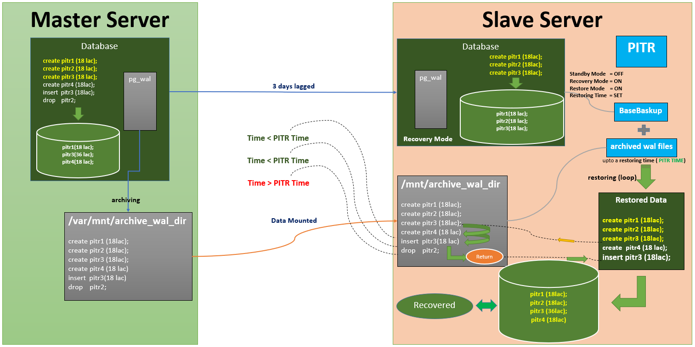

# **PITR Final on (CentOS) Master-Slave(Time Lag)**

---

# **Introduction**

---

## **Overall Planning**


### Details

1. Master Server on left and Slave Server on right
2. Slave Server is lagged (by any duration configured in slave) from Master Server
3. Wal files of Master Server is archiving in archive_wal_dir dynamically
4. archive_wal_dir in Master Server is mounted on archive_wal_dir in Slave Server
5. PITR will be perform on Slave Server and archive_wal_dir  in slave server


## **Scenario**



### Details

1. Master Server has table PITR1, PITR2, PITR3 with 18 lac data each at day 1
2. Slave Server Synced  PITR1 (18 lac), PITR2 (18 lac) , PITR3 (18 lac) after 3 days later. (day 4)
3. After 3 days (day 4) new Data Added in PITR3 (18 lac) 
4. DROP PITR2 from Master at day 4
5. Now Master server have data of PITR1 (18 lac) and PITR3 (36 lac)
6. Slave Server will sync with Master at Day 7 (3 days later).
7. Slaves have data PITR1 (18 lac), PITR2 (18 lac) , PITR3 (18 lac) between day 4 - day 6
8. So if we want to recover the lost data we need to perform PITR between day 4 and day 6 otherwise master data will be sync with slave on day 7
9. If we want to perform PITR upto point(4). 
	- Note the time. 
	- Stop the slave server, 
	- Turn off standby mode, 
	- Turn on recovery mode 
11. Performing PITR upto point (4) 
12. Data Restored

---

---

# **Chapter-01: Postgres-13 Installation**

---


---

# **Chapter-02: Archive Folder Mounting**

---

## Step 1: Installation (`Slave`)

```shell
~: $ yum -y install epel-release
~: $ yum install -y fuse-sshfs
```

## Step 2: cd to `/var/mnt` directory (`Master`)

```shell
imrul@master :~$ cd /var/mnt
```

## Step 3: Create a directory in this location (`Master`)

```shell
imrul@master :~$ sudo mkdir archive_wal_dir        
# This folder contains data that to be shared with another server
imrul@master :~$ sudo chmod a+rwx archive_wal_dir
# This folder needs permission 
```

## Step 4: cd to `/mnt` directory (Slave)

```shell
imrul@slave :~$ cd /mnt
```

## Step 5: Create a directory in this location (`Slave`)

```shell
imrul@slave :~$ sudo mkdir archive_wal_dir          
# This is mountpoint. All the data of Master are shared on this Slave
```

## Step 6: SSHFS from slave (`Slave`)

```shell
imrul@slave:~$ sshfs user@[ip]:/var/mnt/archive_wal_dir /mnt/archive_wal_dir
```

- ip	⇒  master ip address
- user	⇒ user_name of server
- `/var/mnt/archive_wal_dir` 	⇒ Source Location of Archive Folder
- `/mnt/archive_wal_dir`		⇒ Destination Location of Archive Folder

---

# **Chapter-03: Archiving in Master**

---


---

# **Chapter-04: Streaming Replication**

---


---

# **Chapter-05: Delay Replication**

---


---

# **Chapter-06:  Incident made in Master DB**

---


---

# **Chapter-07: PITR on Slave Server**

---


---

# **Chapter-08: Cautions**

---


