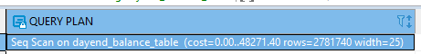
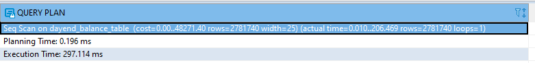
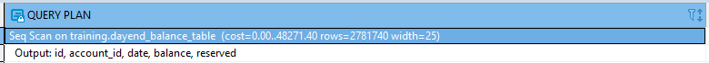
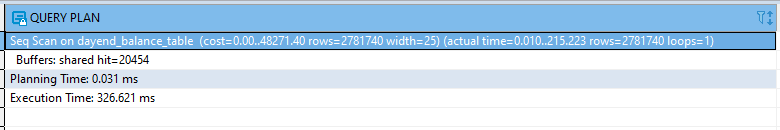
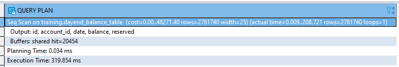

# **Query Performance Tuning**

---

# **Index**

---

1. EXPLAIN [Query](#Query-1)
    1. EXPLAIN Options 
    2. Sample Runs and Output 
    3. Graphical Outputs 
2. Gathering Statistics on Statements [Query](#Query-2) 
3. Writing Better Queries [Query](#Query-3)
    1. Overusing Subqueries in SELECT 
    2. Avoid SELECT * 
    3. Make Good Use of CASE 
    4. Using FILTER Instead of CASE 
4. Parallelized Queries [Query](#Query-4) 
    1. What Does a Parallel Query Plan Look Like? 
    2. Parallel Scans 
    3. Parallel Joins 
5. Guiding the Query Planner [Query](#Query-5) 
    1. Strategy Settings 
    2. How Useful Is Your Index? 
    3. Table Statistics 
    4. Random Page Cost and Quality of Drives
6. Caching [Query](#Query-6)

---

---


[Index](#Index)

## **Query-1**

# **EXPLAIN**

---

```sql
--planner intends to execute the query without running it
explain select * from training.dayend_balance_table;
```



```sql
--comparative analysis of expected versus actual
explain (analyze) select * from training.dayend_balance_table;
```




```sql
--report down to the columnar level.
explain (VERBOSE) select * from training.dayend_balance_table;
```



```sql
--report share hits
explain (analyze,buffers) select * from training.dayend_balance_table;
```



```sql
--all details, including timing, output of columns, and buffers
explain (analyze,verbose,buffers) select * from training.dayend_balance_table ;
```



---


