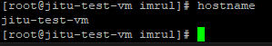
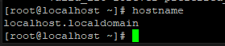
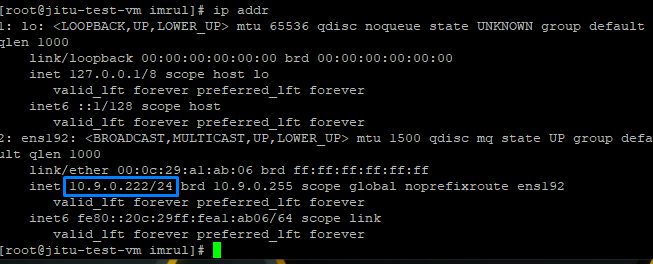
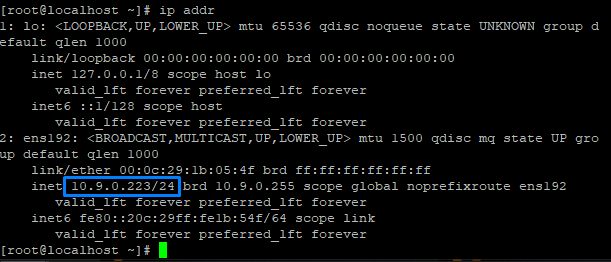
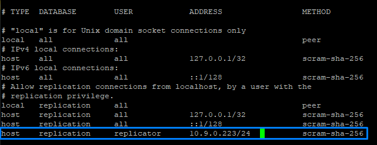
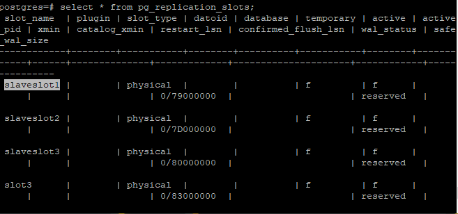
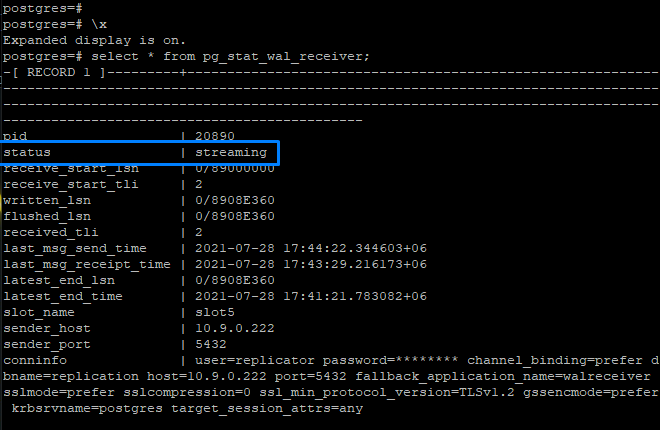
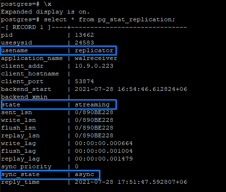

# **Streaming Replication (Ubuntu)**

---

- https://www.postgresql.r2schools.com/how-to-setup-streaming-replication-in-postgresql-step-by-step-on-ubuntu/

- https://www.youtube.com/watch?v=LhPAg583pKc

---

## Host Name

---

### Master

```shell
hostname   
```




### Slave

```shell
hostname   
```



---


## IP Address


---


### Master

```shell
ip addr
```




### Slave

```shell
ip addr
```




---

## Configure the Master Server

---

- before modifying the file best practice to store back up.

### Step 1: Configure `postgresql.conf`

---

```shell
vi /var/lib/pgsql/13/data/postgresql.conf  # Open in VI editor
```

- Search for `listen_addresses` using `:/listen_`


```shell
listen_addresses = '*'
```

> Replace localost with `*`

> `*` means connections from all the clients.

- Save the file and Exit.

> Now we have to create replication user on master server.

---

### Step 2: Create `replication` user

---


```sql
postgres=# CREATE USER replicator WITH REPLICATION ENCRYPTED PASSWORD 'replicator' ;
```

---

### Step 3: Add Standby Server

---

```shell
vi /var/lib/pgsql/13/data/pg_hba.conf
```



> Added the last line.

---

### Step 4: Restart the DB cluster

```shell
sudo systemctl restart postgresql-13
sudo systemctl status postgresql-13
```

---

## Configure the Slave Server

---

### Step 1: Stop the Slave Server

```shell
sudo systemctl status postgresql-13
sudo systemctl stop postgresql-13
```

---

### Step 2: Take backup of data folder

- Switch to `postgres` user

---

```shell
cp -R /var/lib/postgresql/13/data/ /var/lib/postgresql/13/data_old/
rm -rf /var/lib/postgresql/13/data
```

---

### Step 3: take Base Backup

---

```shell
pg_basebackup -h 10.9.0.222 -D /var/lib/postgresql/13/data/ -U replicator -P -v -R -X stream -C -S slaveslot1
```
- Note: `right` ownership with `postgres`

```shell
sudo chown -R postgres /var/lib/pgsql/13/data   # This ownership need to be set in Master Server
```

> Then provide the password for user `replicator` created in master server.

---

### Step 4: Observe the data directory

---

```shell
cd /var/lib/postgresql/13/data/
ls
ls -ltrh /var/lib/pgsql/13/data
```

---

### Step 5: Check the DB cluster

---

```shell
sudo systemctl status postgresql-13
sudo systemctl start postgresql-13
```

---

## Review

---

### Some query on Slave Server

---

```sql
select datname from pg_database;    -- OK
select pitr.*;                      -- OK
create database test;               -- Can't Execute in a read only transaction (Standby Server)
```

---

### Some query on Master Server

---

```sql
select datname from pg_database;    -- OK
select pitr.*;                      -- OK
create database test;               -- OK
```

---

## Check some configuration

---

- `Master Server`

```sql
select * from pg_replication_slots;
```

> 

---

- `Slave Server`

```sql
select * from pg_stat_wal_receiver;
```

- 

- `Master Server`

```sql
select * from pg_stat_replication;
```

- 

---


