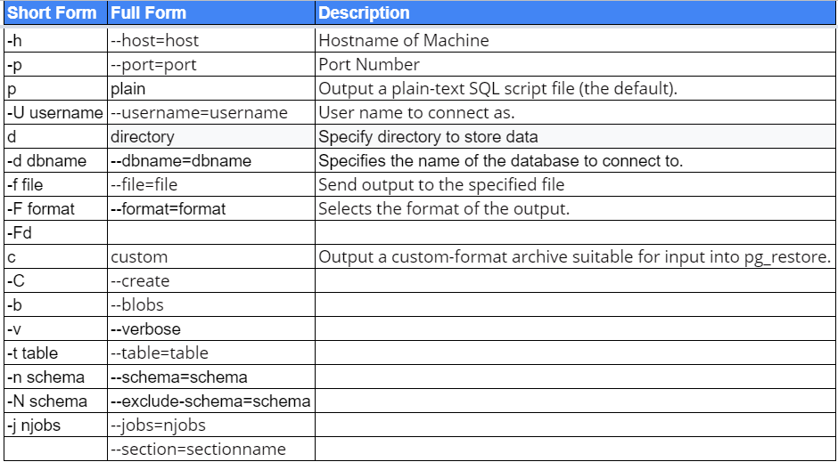

# **Database Administration**

---

# **Index**

---

1. Configuration Files [Query](#Query-1)
	1. Introduction
	2. Making Configurations Take Effect 
	3. The postgresql.conf file 
	4. The pg_hba.conf file 
2. Managing Connections [Query](#Query-2)
	1. Introduction
3. Check for Queries being blocked [Query](#Query-3)
4. Roles [Query](#Query-4)
	1. Creating Roles
	2. Creating Group Roles
5. Database Creation [Query](#Query-5)
	1. Template Databases 
	2. Using Schemas
6. Privileges [Query](#Query-6)
	1. Types of Privileges 
	2. Getting Started 
	3. GRANT
	4. Revoke
	5. Default Privileges
	6. Privilege Idiosyncrasies 
7. Extensions [Query](#Query-7)
	1. Installing Extensions 
	2. Common Extensions 
8. Backup and Restore [Query](#Query-8)
	1. Introduction
	2. Selective Backup Using pg_dump
	3. Systemwide Backup Using pg_dumpall
	4. Restoring data using psql
	5. Restoring data using pg_restore
9. Managing Disk Storage with Tablespaces [Query](#Query-9)
	1. Creating Tablespaces
	2. Moving Objects Among Tablespaces 
10. Verboten Practices [Query](#Query-10)

---

---


[Index](#Index)

## **Query-1**

# **Configuration Files**

---

---

## Introduction

---

### `postgresql.conf`

> Controls general settings, such as memory allocation, default storage location for new databases, the IP addresses that PostgreSQLlistens on, location of logs, and plenty more.

---

### `pg_hba.conf`

> Controls access to the server, dictating which users can log in to which databases, which IP addresses can connect, and which authentication scheme to accept.

---

### `pg_ident.conf`

```sql
If present, this file maps an authenticated OS login to a PostgreSQLuser. People sometimes map the OS root account to the PostgresSQLsuperuser account, postgres.
```

---

### Scripts

```sql
select
	name,
	setting,
	category
from
	pg_settings
where
	category = 'File Locations';
```


---

## Making Configurations Take Effect 

---

### Reloading

- if context = user

```sql
SELECT pg_reload_conf();
```

```cmd
service postgresql-9.5 reload
```

> You may skip the version in command

---

### Restarting

- if context = postmaster

> You can’t restart with a `PostgreSQLcommand`

```cmd
service postgresql-9.5 restart
```
> You may skip the version in command

---

## The postgresql.conf file 

---

### Key settings

```sql
--Key settings
select
	name,
	context,
	unit,
	setting,
	boot_val,
	reset_val
from
	pg_settings
where
	name in('listen_addresses', 'deadlock_timeout', 'shared_buffers', 'effective_cache_size', 'work_mem', 'maintenance_work_mem')
order by
	context,
	name;
```

```sql
--display settings 
SHOW shared_buffers;
```

```sql
SHOW deadlock_timeout;
```

```sql
--the units for all settings
show all;
```

---

### Querying pg_file_settings

```sql
--Querying pg_file_settings
select
	name,
	sourcefile,
	sourceline,
	setting,
	applied
from
	pg_file_settings
where
	name in ('listen_addresses', 'deadlock_timeout', 'shared_buffers' ,'effective_cache_size', 'work_mem', 'maintenance_work_mem')
order by
	name;
```

---

### change settings

```sql
--Changing the postgresql.conf settings
ALTER SYSTEM SET work_mem = '500MB';
SELECT pg_reload_conf();
```

---

### "server won’t start.”

> “I edited my postgresql.conf and now my server won’t start.” The easiest way to figure out what you screwed up is to look at the log file, located at the root of the data folder, or in the pg_log subfolder. Open the latest file and read what the last line says. The error raised is usually selfexplanatory. A common culprit is setting shared_buffers too high. Another suspect is an old postmaster.pid left over from a failed shutdown. You can safely delete this file, located in the data cluster folder, and try restarting again.


---


## The pg_hba.conf file 

---

### "server is broken"

> “I edited my pg_hba.conf and now my server is broken.” Don’t worry. This happens quite often, but it’s easily recoverable. This error is generally caused by typos or by adding an unavailable authentication scheme. When the postgres service can’t parse pg_hba.conf, it blocks all access just to be safe. Sometime, it won’t even start up. The easiest way to figure out what you did wrong is to read the log file located in the root of the data folder or in
the pg_log subfolder. Open the latest file and read the last line. The error message is usually self-explanatory. If you’re prone to slippery fingers, back up the file prior to editing.

---

---


---

[Index](#Index)

## **Query-2**

# **Managing Connections**

---

---

## Introduction

---

### Retrieve

```sql
-- All States
select
	t.datname,
	t.pid,
	t.usename,
	t.backend_start,
	t.state_change,
	t.state,
	t.query ,
	application_name
from
	pg_stat_activity t;

---All Active States
select
	t.datname,
	t.pid,
	t.usename,
	t.backend_start,
	t.state_change,
	t.state,
	t.query ,
	application_name
from
	pg_stat_activity as t
where
	state = 'active';
```


### Cancel

- Cancel active queries on a connection with process id 1234:

```sql
SELECT pg_cancel_backend(procid)
```

- This does not terminate the connection itself, though.

### Terminate

- Terminate the connection:

```sql
SELECT pg_terminate_backend(procid)
```

### Multiple Terminate

```sql
-- Terminate multiple active state at a time for a usename
select
	pg_terminate_backend(pid)
from
	pg_stat_activity
where
	usename = 'imrul';
```

---


---

[Index](#Index)

## **Query-4**

# **Roles**

---

---

## Creating Roles

---

```sql
--CREATE ROLE WITH ONE/MULTITPLE PERMISSION WITH SPACE SEPERATED 
CREATE ROLE imrul WITH LOGIN ENCRYPTED PASSWORD 'pass' SUPERUSER CREATEDB CREATEROLE  VALID UNTIL '2022-1-1 00:00';
drop ROLE imrul ;
ALTER ROLE imrul WITH LOGIN ENCRYPTED PASSWORD 'pass' SUPERUSER CREATEDB CREATEROLE  VALID UNTIL '2022-1-1 00:00';
```

---

## Creating Group Roles 

---

### group with user

```sql
---Group Role
CREATE ROLE imrul WITH LOGIN ENCRYPTED PASSWORD '0467850' ; --imrul can log in
CREATE ROLE data_analyst INHERIT;	-- data_analyst group
ALTER ROLE data_analyst WITH CREATEDB VALID UNTIL '2022-1-1 00:00'; -- data analyst group have access: createdb
GRANT data_analyst TO imrul ;		--assign data analyst role to imrul ; data anaylst have role: createdb
drop ROLE imrul ;
drop ROLE data_analyst ;
```

---

### Inheriting rights

> One quirk (or convenience) in PostgreSQL is the ability to specify that a group role not pass its rights to member roles. To avoid having to remember the default value, you should always append the INHERIT keyword if you want members to inherit the rights of the parent role, and NOINHERIT if you don’t want them to inherit the rights of the
parent role. Some rights can’t be inherited. For example, although you can create a group role that you mark as superuser, this doesn’t make its member roles superusers; however, those users can “impersonate” their parent role through the use of SET ROLE, thereby gaining superuser rights for the duration of the session. For instance, a member of the royal ty group can take on that role through.

---

---

[Index](#Index)

## **Query-5**

# **Database Creation**

---

---

## Template Databases 

> A template database is, as the name suggests, a database that serves as a model for other databases. When you create a new database, PostgreSQL copies all the database settings and data from the template database into yours. The default PostgreSQL installation comes with two template databases: template0 and template1. If you don’t specify a template database to follow when you create a database, the template1 database is used as the template for the new database. You should never alter template0 because it is the immaculate mod‐ el that you’ll need to copy from if you screw up your templates. Make your customizations to template1 or a new template database you create. You can’t change the encoding and collation of a database you create from template1 or any other template database you create. So if you need a different encoding or collation from those in tem plate1, create the database from template0.

---

### Create DB with Template

```sql
---Create a new DB
CREATE DATABASE template_db;


--To set an existing database as a template database:

--Option 1:
ALTER DATABASE template_db WITH is_template TRUE;

--Option 2:
UPDATE pg_database SET datistemplate = TRUE WHERE datname = 'template_db';


--To create a new database with this template:
CREATE DATABASE new_db TEMPLATE template_db ;
```

---

### Custom DB

```sql
CREATE DATABASE cusdbtmp 
WITH 
   ENCODING = 'UTF8'
   OWNER = imrul
   CONNECTION LIMIT = 100
   TEMPLATE = template_db
;
```

---

### template0

> template0: template0 contains the same data as template1. We could think of this template database as a fallback if anything irreversible happens to template1. As such, this template database should never be modified in any way as soon as the database cluster has been initialized. To create a database with template0 as the template database:

```sql
CREATE DATABASE new_db_name TEMPLATE template0;
```

---

### Application

> Applications: If anything goes wrong with template1, It can be dropped and recreated with template0 as the template database. We can also create a clean database that does not contain any modifications present in template1. This would be useful when restoring from pg_dump. Any conflicts brought about by modifications not present in the dump are eliminated. template0 can be used to specify new encodings. As pointed out in this article, creating a new database with template1 and new encodings would result in an error.

```sql
-- Will succeed
CREATE DATABASE new_db_name TEMPLATE template0 ENCODING 'SQL_ASCII';

-- Will return an error
CREATE DATABASE new_db_name ENCODING 'SQL_ASCII';
```

---

## Using Schemas

---

### create schema

```sql
--To create some useful structure, before you install any extensions, create a new schema:
CREATE SCHEMA my_extensions;
```

---

### add to search path

```sql
--Then add your new schema to the search path:
ALTER DATABASE dba SET search_path='"$user", public, my_extensions';
```

---

### drop schema

```sql
--drop schema
drop schema my_extensions;
```

---

---

[Index](#Index)

## **Query-6**

# **Privileges**

---

---

## Types of Privileges 

---

### Types

```sql
--Types of Privileges
SELECT, INSERT, UPDATE, ALTER, EXECUTE, TRUNCATE
```

---

## Getting Started 

---

### New Role

```sql
--Create new login role with pass
CREATE ROLE mydb_admin LOGIN PASSWORD 'something';

--Create the database and set the owner:
CREATE DATABASE mydb WITH owner = mydb_admin;
```

---

## GRANT

- GRANT The GRANT command assigns privileges to others. The basic usage is: 

```sql
GRANT some_privilege TO some_role;
```

- A few things to keep in mind when it comes to GRANT:
	- You need to be the holder of the privilege that you’re granting and you must have rant privilege yourself. You can’t give away what you don’t have.
	- Some privileges always remain with the owner of an object and can never be granted away. These include DROP and ALTER.
	- The owner of an object already has all privileges. Granting an owner privilege in what it already owns is unnecessary.
	- When granting privileges, you can add WITH GRANT OPTION. This means that the grantee can grant onwards:
	```sql 
	GRANT ALL ON ALL TABLES IN SCHEMA public TO mydb_admin WITH GRANT OPTION; 
	```

	- To grant all relevant privileges on an object use ALL instead of the specific privilege:
	```sql
	GRANT SELECT, REFERENCES, TRIGGER ON ALL TABLES IN SCHEMA my_schema TO PUBLIC;
	```
	- The ALL alias can also be used to grant for all objects within a database or schema:
	```sql
	GRANT SELECT, UPDATE ON ALL SEQUENCES IN SCHEMA my_schema TO PUBLIC;
	```
	- To grant privileges to all roles, you can use the alias PUBLIC:
	```sql
	GRANT USAGE ON SCHEMA my_schema TO PUBLIC;
	```
- The GRANT command is covered in gorgeous detail in GRANT. We strongly recommend that you take the time to study the few pages before you inadvertently knock a big hole in your security wall.
- Some privileges are by default granted to PUBLIC. These are CONNECT and CREATE TEMP TABLE for databases, EXECUTE for functions, and USAGE for languages. In many cases you might consider revoking some of defaults for your own safety. Use the REVOKE command:
```sql
REVOKE EXECUTE ON ALL FUNCTIONS IN SCHEMA my_schema FROM PUBLIC;
```

---

### Grant Format

```sql
GRANT { { SELECT | INSERT | UPDATE | DELETE | TRUNCATE | REFERENCES | TRIGGER }
    [,...] | ALL [ PRIVILEGES ] }
    ON { [ TABLE ] table_name [, ...]
         | ALL TABLES IN SCHEMA schema_name [, ...] }
    TO { [ GROUP ] role_name | PUBLIC } [, ...] [ WITH GRANT OPTION ]

GRANT { { SELECT | INSERT | UPDATE | REFERENCES } ( column [, ...] )
    [,...] | ALL [ PRIVILEGES ] ( column [, ...] ) }
    ON [ TABLE ] table_name [, ...]
    TO { [ GROUP ] role_name | PUBLIC } [, ...] [ WITH GRANT OPTION ]

GRANT { { USAGE | SELECT | UPDATE }
    [,...] | ALL [ PRIVILEGES ] }
    ON { SEQUENCE sequence_name [, ...]
         | ALL SEQUENCES IN SCHEMA schema_name [, ...] }
    TO { [ GROUP ] role_name | PUBLIC } [, ...] [ WITH GRANT OPTION ]

GRANT { { CREATE | CONNECT | TEMPORARY | TEMP } [,...] | ALL [ PRIVILEGES ] }
    ON DATABASE database_name [, ...]
    TO { [ GROUP ] role_name | PUBLIC } [, ...] [ WITH GRANT OPTION ]

GRANT { USAGE | ALL [ PRIVILEGES ] }
    ON FOREIGN DATA WRAPPER fdw_name [, ...]
    TO { [ GROUP ] role_name | PUBLIC } [, ...] [ WITH GRANT OPTION ]

GRANT { USAGE | ALL [ PRIVILEGES ] }
    ON FOREIGN SERVER server_name [, ...]
    TO { [ GROUP ] role_name | PUBLIC } [, ...] [ WITH GRANT OPTION ]

GRANT { EXECUTE | ALL [ PRIVILEGES ] }
    ON { FUNCTION function_name ( [ [ argmode ] [ arg_name ] arg_type [, ...] ] ) [, ...]
         | ALL FUNCTIONS IN SCHEMA schema_name [, ...] }
    TO { [ GROUP ] role_name | PUBLIC } [, ...] [ WITH GRANT OPTION ]

GRANT { USAGE | ALL [ PRIVILEGES ] }
    ON LANGUAGE lang_name [, ...]
    TO { [ GROUP ] role_name | PUBLIC } [, ...] [ WITH GRANT OPTION ]

GRANT { { SELECT | UPDATE } [,...] | ALL [ PRIVILEGES ] }
    ON LARGE OBJECT loid [, ...]
    TO { [ GROUP ] role_name | PUBLIC } [, ...] [ WITH GRANT OPTION ]

GRANT { { CREATE | USAGE } [,...] | ALL [ PRIVILEGES ] }
    ON SCHEMA schema_name [, ...]
    TO { [ GROUP ] role_name | PUBLIC } [, ...] [ WITH GRANT OPTION ]

GRANT { CREATE | ALL [ PRIVILEGES ] }
    ON TABLESPACE tablespace_name [, ...]
    TO { [ GROUP ] role_name | PUBLIC } [, ...] [ WITH GRANT OPTION ]

GRANT role_name [, ...] TO role_name [, ...] [ WITH ADMIN OPTION ]
```

---

### Grant on Function

```sql
--For All to All role
GRANT ALL ON FUNCTION training.functionname(varchar,varchar) TO public;

--For role imrul only
GRANT ALL ON FUNCTION training.functionname(varchar,varchar) TO imrul;
```

---

### Grant on Procedure

```sql
--Grant All to All On Procedure
GRANT ALL ON PROCEDURE training.procedurename(varchar,varchar,numeric) TO public;

--Grant All to imrul On Procedure
GRANT ALL ON PROCEDURE training.procedurename(varchar,varchar,numeric) TO imrul;
```

---

### Grant on Table

```sql
--Grant ALL PRIVILEGES to imrul on table
GRANT ALL ON TABLE training.tablename TO imrul;

--Grant ALL PRIVILEGES to group role data_analyst on table
GRANT ALL ON TABLE training.tablename TO data_analyst;
```

---

### Grant All

```sql
GRANT ALL ON ALL TABLES IN SCHEMA public TO imrul WITH GRANT OPTION;
```

---

### Grant Some

```sql
GRANT SELECT, REFERENCES, TRIGGER ON ALL TABLES IN SCHEMA test TO imrul;
```

---

### Grant All  to All Roles

```sql
-- To grant privileges to all roles, you can use the alias PUBLIC:
GRANT USAGE ON SCHEMA test TO PUBLIC;
```

---

### Grant All to a Role

```sql
GRANT USAGE ON SCHEMA public TO my_user;
```

---

## Revoke

```sql
-- Some privileges are by default granted to PUBLIC. These are CONNECT and CREATE TEMP
-- TABLE for databases, EXECUTE for functions, and USAGE for languages. In many cases you
-- might consider revoking some of defaults for your own safety. Use the REVOKE command:
REVOKE EXECUTE ON ALL FUNCTIONS IN SCHEMA my_schema FROM PUBLIC;
```

---

### Revoke from Public on Functions in particular Schema

```sql
--Revoke On Function in Schema test from public
REVOKE EXECUTE ON ALL FUNCTIONS IN SCHEMA test FROM PUBLIC;
```

---

### Revoke from a role on Functions in particular Schema

```sql
--Revoke On Function in Schema test from imrul
REVOKE EXECUTE ON ALL FUNCTIONS IN SCHEMA test FROM imrul;
```

---

## Default Privileges

---

### Scripts

```sql
GRANT USAGE ON SCHEMA my_schema TO PUBLIC;
ALTER DEFAULT PRIVILEGES IN SCHEMA my_schema

GRANT SELECT, REFERENCES ON TABLES TO PUBLIC;
ALTER DEFAULT PRIVILEGES IN SCHEMA my_schema

GRANT ALL ON TABLES TO mydb_admin WITH GRANT OPTION;
ALTER DEFAULT PRIVILEGES IN SCHEMA my_schema

GRANT SELECT, UPDATE ON SEQUENCES TO public;
ALTER DEFAULT PRIVILEGES IN SCHEMA my_schema

GRANT ALL ON FUNCTIONS TO mydb_admin WITH GRANT OPTION;
ALTER DEFAULT PRIVILEGES IN SCHEMA my_schema

GRANT USAGE ON TYPES TO PUBLIC;
```

---

## Privilege Idiosyncrasies 

> Privilege Idiosyncrasies Before we unleash you to explore privileges on your own, we do want to point out a few quirks that may not be apparent. Unlike in other database products, being the owner of a PostgreSQL database does not give you access to all objects in the database, but it does grant you privileges to whatever objects you create and allows you to drop the database. Another role can create objects that you can’t access in your owned database. Interestingly, though, you can still drop the whole database. People often forget to set GRANT USAGE ON SCHEMA or GRANT ALL ON SCHEMA. Even if your tables and functions have rights assigned to a role, these tables and functions will still not be accessible if the role has no USAGE rights to the schema.

---


---

[Index](#Index)

## **Query-7**

# **Extensions**

---

---

## Installing Extensions 

> Extensions, formerly called contribs, are add-ons that you can install in a PostgreSQL database to extend functionality beyond the base offerings. They exemplify the best of open source software: people collaborating, building, and freely sharing new features. Since version 9.1, the new PostgreSQL extension model has made adding extensions a cinch. As a note on terminology, older add-ons outside the extension mod‐ el should still be called contribs, but with an eye toward the future, we’ll call them all extensions.
Not all extensions need to be in all databases. You should install extensions to your individual database on an as-needed basis. If you want all your databases to have a certain set of extensions, you can develop a template database, as discussed in “Template Da‐ tabases” on page 27, with all the the extensions installed, and then beget future databases from that template. Occasionally prune extensions that you no longer need, to avoid bloat. Some extensions take up quite a bit of space. To see which extensions you have already installed on your server, run the query in Example 2-7. Your list could vary significantly from ours.

---

### Installed extensions

```sql
select
	name,
	default_version,
	installed_version,
	left(comment, 30) as comment
from
	pg_available_extensions
where
	1=1
	and installed_version is not null
order by
	name;
```

---

### Un Installed extensions

```sql
select
	name,
	default_version,
	installed_version,
	left(comment, 30) as comment
from
	pg_available_extensions
where
	1=1
	and installed_version is null
order by
	name;
```

---

### Package in extension?

```sql
--To get more details about a particular extension already installed on your server, enter the following command from psql:

--psql:
-------
\dx+ plpgsql
```

```sql
--Query
-------
--Find if extension is installed
select
	pg_catalog.pg_describe_object(d.classid,d.objid,0) as description
from
	pg_catalog.pg_depend as D
inner join pg_catalog.pg_extension as E on
	D.refobjid = E.oid
where
	D.refclassid = 'pg_catalog.pg_extension'::pg_catalog.regclass
	and deptype = 'e'
	and E.extname = 'plpgsql';
```

---

### Installation


```sql
-----Installing Extensions

--Step 1: Installing on the server
----------------------------------

--download binary files and requisite libraries
--copy 'binary' files to bin and lib folder
--copy 'script' files to 'share/extension' or 'share/contrib'

--Check in server
SELECT * FROM pg_available_extensions; --We can Install only those extension which can be found in this query


--Step 2: Installing into a database (9.1 and later)
----------------------------------------------

CREATE EXTENSION fuzzystrmatch SCHEMA public ;	--in public schema


--- Now check Installed extention
select
	name,
	default_version,
	installed_version,
	left(comment, 60) as comment
from
	pg_available_extensions
where
	1=1
	and installed_version is not null
order by
	name;


---Install using psql
--------------------------
psql -p 5432 -d mydb -c "CREATE EXTENSION fuzzystrmatch;"
```

---

### Important Extension

- plpgsql
- dblink
- fuzzystrmatch
- hstore
- mysql_fdw
- pg_trgm
- postgres_fdw
- tablefunc
- pg_stat_statements


---

---

### Upgrade to New Extension


- Upgrading to the new extension model

> If you’ve been using a version of PostgreSQL older than 9.1 and restored your old database into version 9.1 or later during a version upgrade, all extensions should continue to function without intervention. For maintainability, you should upgrade your old extensions in the contrib folder to use the new approach to extensions. You can upgrade extensions, especially the ones that come packaged with PostgreSQL, from the old con‐ trib model to the new one. Remember that we’re referring only to the upgrade in the installation model, not to the extension itself.
For example, suppose you had installed the tablefunc extension (for cross-tab queries) to your PostgreSQL 9.0 in a schema called contrib, and you’ve just restored your da‐ tabase to a 9.1 server. Run the following command to upgrade:

```sql
CREATE EXTENSION tablefunc SCHEMA contrib FROM unpackaged;
```

> This command searches through contrib, finds all components for the extension, and packages them into a new extension object so it appears in the pg_available_exten
sions list as being installed. You can still install an extension in a database with psql without first connecting to the database:

```sql
psql -p 5432 -d mydb -c "CREATE EXTENSION fuzzystrmatch;"
```

> This command leaves the old functions in the contrib schema intact but removes them from being a part of a database backup.


---


---

[Index](#Index)

## **Query-8**

# **Backup and Restore**

---

---

## Introduction

```sql
-----Backup and Restore
-----------------------

--Selective Backup
------------------
--pg_dump		:: backup specific db


--Systemwide Backup
-------------------
--pg_dumpall	:: backup all db and server globals. pg_dumpall needs to run under a superuser account.


/*
	Important:: You may also want to create a ~/.pgpass file to store all passwords. pg_dump and pg_dump
	all don’t have password options. Alternatively, you can set a password in the PGPASS
	WORD environment variable
*/
```

---

### Syntax



---

## Selective Backup Using pg_dump

---

### Compress Bkp Single DB

```sql
------To create a compressed, single database backup:: Compress Bkp Single DB
pg_dump -h localhost -p 5432 -U postgres -F c -b -v -f dvdrental.backup dvdrental
```

---

### PlainTxt Bkp Single DB with Create

```sql
---To create a plain-text single database backup, including a CREATE DATABASE statement:: PlainTxt Bkp Single DB with Create
pg_dump -h localhost -p 5432 -U postgres -C -F p -b -v -f dvdrental.backup dvdrental
```

---

### Compress Bkp Single DB(matched table)

```sql
--To create a compressed backup of tables whose names start with “pay” in any schema:: Compress Bkp Single DB(matched table)
pg_dump -h localhost -p 5432 -U postgres -F c -b -v -t *.pay* -f dvdrental.backup dvdrental
```

---

### Compress Bkp Single DB(Matched Schemas)

```sql
--To create a compressed backup of all objects in the hr and payroll schemas:: Compress Bkp Single DB(Matched Schemas)
pg_dump -h localhost -p 5432 -U postgres -F c -b -v -n "binary" -n public -f dvdrental.backup dvdrental
```

---

### Compress Bkp Single DB(exclude a schema)

```sql
--To create a compressed backup of all objects in all schemas, excluding the public schema:: Compress Bkp Single DB(exclude public schema)
pg_dump -h localhost -p 5432 -U postgres -F c -b -v -N public -f dvdrental.backup dvdrental
```

---

### bkp select tables

```sql
/*
	To create a plain-text SQL backup of select tables, useful for porting structure and data
	to lower versions of PostgreSQL or non-PostgreSQL databases (plain text generates a
	SQL script that you can run on any system that speaks SQL):
*/
pg_dump -h localhost -p 5432 -U postgres -F p --column-inserts -f select_tables.backup dvdrental
```

---

### Directory format backup

```sql
--Directory format backup
--- Example 1:
pg_dump -h localhost -p 5432 -U someuser -F d -f /somepath/a_directory mydb

--- Example 2: 
pg_dump -h localhost -p 5432 -U postgres -F d -f D:\ dvdrental
```

---

### Directory format parallel backup

```sql
--Directory format parallel backup
--- Example 1: 
pg_dump -h localhost -p 5432 -U someuser -j 3 -Fd -f /somepath/a_directory mydb

--- Example 2: 
pg_dump -h localhost -p 5432 -U postgres -j 3 -Fd -f /somepath/a_directory dvdrental
```

---


## Systemwide Backup Using pg_dumpall

---

### Bkp roles and tablespace

```sql
---To back up roles and tablespaces:: Bkp roles and tablespace
pg_dumpall -h localhost -U postgres --port=5432 -f myglobals.sql --globals-only
```

---

### Bkp roles only

```sql
--If you care only about backing up roles and not tables spaces, use the --roles-only option:: Bkp roles only
pg_dumpall -h localhost -U postgres --port=5432 -f myroles.sql --roles-only
```

---

## Restoring data using psql [NOT TESTED BY ME]

---

### Restore (ingroned on err)

---

```sql
--To restore a full backup and ignore errors:
psql -U postgres -f myglobals.sql
```

---

### Restore (Stop on err)

```sql
--To restore, stopping if any error is found:
psql -U postgres --set ON_ERROR_STOP=on -f myglobals.sql
```

---

### Restore Specific DB

```sql
--To restore to a specific database:
psql -U postgres -d mydb -f select_objects.sql
```

---

## Restoring data using pg_restore [Tested by Me]

---

### Restore

```sql
--To perform a restore using pg_restore, first create the database using SQL:
CREATE DATABASE testdb ;

--Then restore:
pg_restore -h localhost -p 5432 -U postgres --dbname=testdb --jobs=4 --verbose dvdrental.backup
```

---

### Restore (bkp == db)

```sql
--To perform a restore using pg_restore, first create the database using SQL:
CREATE DATABASE testdb ;

--If the database is the same as the one you backed up, you can create and restore the database in one step:
pg_restore -h localhost -p 5432 -U postgres --dbname=testdb --create --jobs=4 --verbose dvdrental.backup
```

---

### Restore Structure(v 9.2 or later)

```sql
--running version 9.2 or later
CREATE DATABASE testdb ;

--Then use pg_restore:: Restore only Structure
pg_restore -h localhost -p 5432 -U postgres --dbname=testdb --section=pre-data --jobs=4 dvdrental.backup
```

---

### Restore Structure and Constraints (2 ways)

```sql
--Restore only Structure and Constraints
--running version 9.2 or later
CREATE DATABASE testdb ;

--Way 1:
--Then use pg_restore::  Using `--section`
pg_restore -h localhost -p 5432 -U postgres --dbname=testdb --section=pre-data --section=post-data --jobs=4 dvdrental.backup


--Way 2:
--Then use pg_restore::  Using `--schema`
pg_restore -h localhost -p 5432 -U postgres --dbname=testdb --schema-only --jobs=4 dvdrental.backup
```

---

---


---

[Index](#Index)

## **Query-9**

# **Managing Disk Storage with Tablespaces**

---

---


## Creating Tablespace

```sql
---- Creating Tablespaces
-------------------------

-- Windows OS
CREATE TABLESPACE secondary LOCATION 'C:\pgdata94_secondary';


-- Linux 
CREATE TABLESPACE secondary LOCATION '/usr/data/pgdata94_secondary';
```


## Moving Objects Between Tablespaces

```sql
---Moving Objects Between Tablespaces
-------------------------------------

--To move all objects in the database to our secondary tablespace
ALTER database testdb SET TABLESPACE secondary;

--To move just one table:
ALTER TABLE test.test_table SET TABLESPACE secondary;

--To move all objects from default tablespace to secondary:
ALTER TABLESPACE pg_default MOVE ALL TO secondary;
```

---


---

[Index](#Index)

## **Query-10**

# **Verboten Practices**

---

---

- Don’t Delete PostgreSQL Core System Files and Binaries
- Don’t Give Full OS Administrative Rights to the Postgres System
Account (postgres)
- Don’t Set shared_buffers Too High
- Don’t Try to Start PostgreSQL on a Port Already in Use

---


